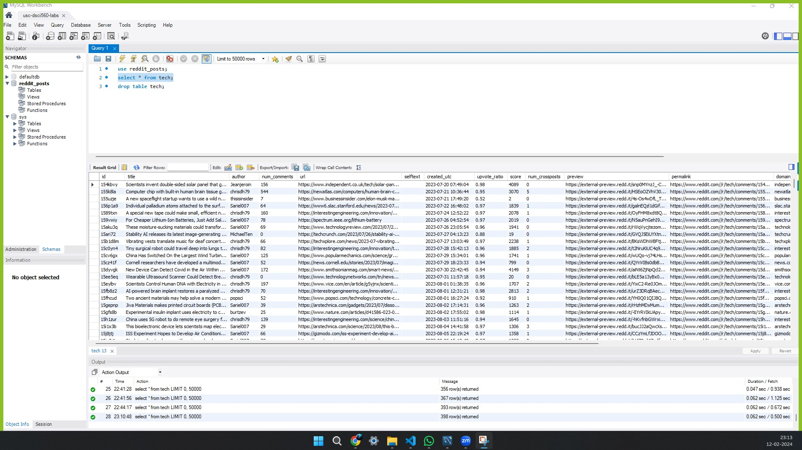

# Lab 4 Part 1 - Reddit API Data Extraction

## Important Files
Make sure files are present in to root directory of the project
1. .env - File with environment variables
2. ca.pem - Certifcate Authentication file for database
3. requirements.txt - File with dependencies to installed for the project

## Setup
- For setup move into `reddit-scraper` directory
```bash
cd reddit-scraper
```

- Create and active a virtual environment
```bash
virtualenv venv
source venv/bin/activate  # or "venv\Scripts\activate" on Windows
```
- To install the necessary libraries
```bash
pip install -r requirements.txt
```

## Running the script
- Make sure the all the important files listed above are present at the correct location
- Virtual Environment is created and activated
- To run the script
    - Move into the `/src` directory
    ```bash
    cd src
    ```
    - Run the `main.py` script
    ```bash
    python main.py
    ```
    - To scrape more posts a `line 107` can be modified in the `main.py` file.
    ```py
    new_post_count = <enter your desired number>
    ```
    - Scraping may take some time so please be patient.
- Data Collected is processed and ingested into MySQL database.

## To view the data ingested data MySQL database
- Open `MySQL Workbench`. Use the following environment variables to connect to the database
    - MYSQL_USERNAME
    - MYSQL_PASSWORD
    - MYSQL_HOST

- Snapshot after a successful connection to the database
    


<!-- ## Author:
- Name: Kayvan Shah
- Email: kpshah@usc.edu
- USC ID: 1106650685 -->